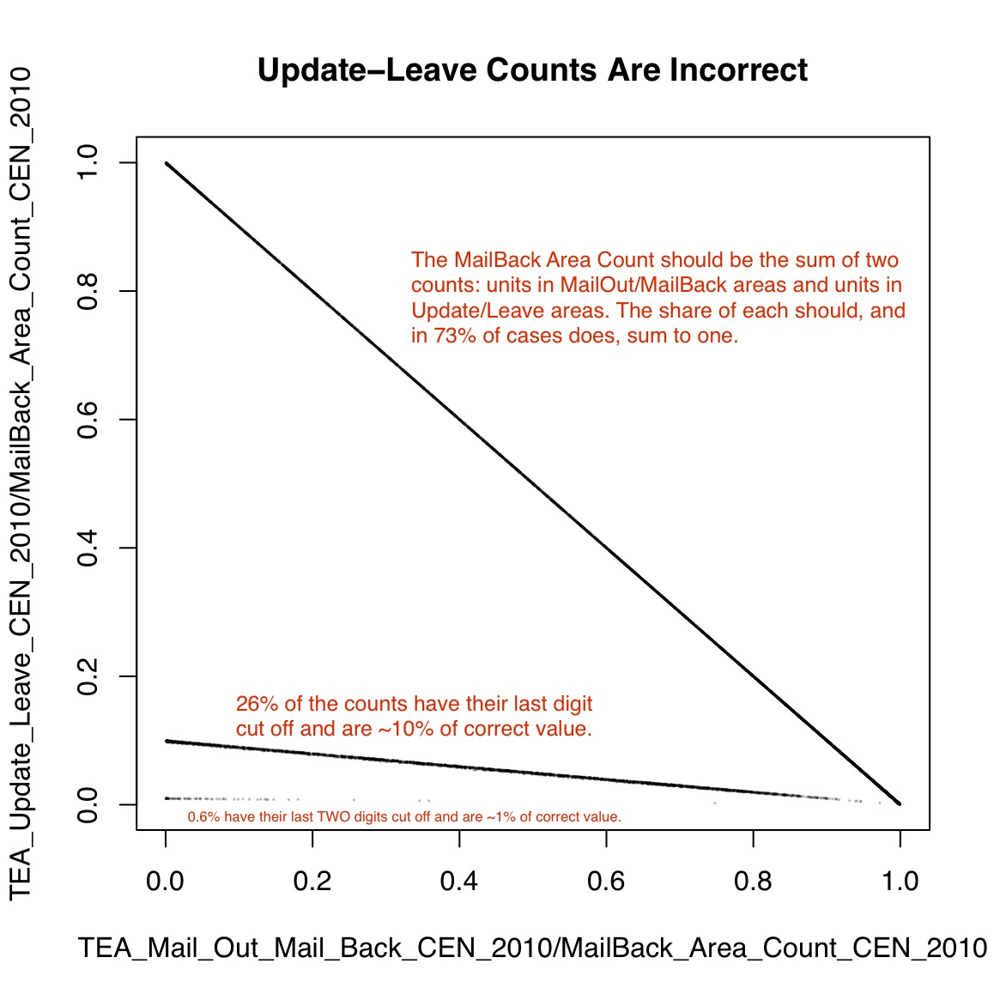
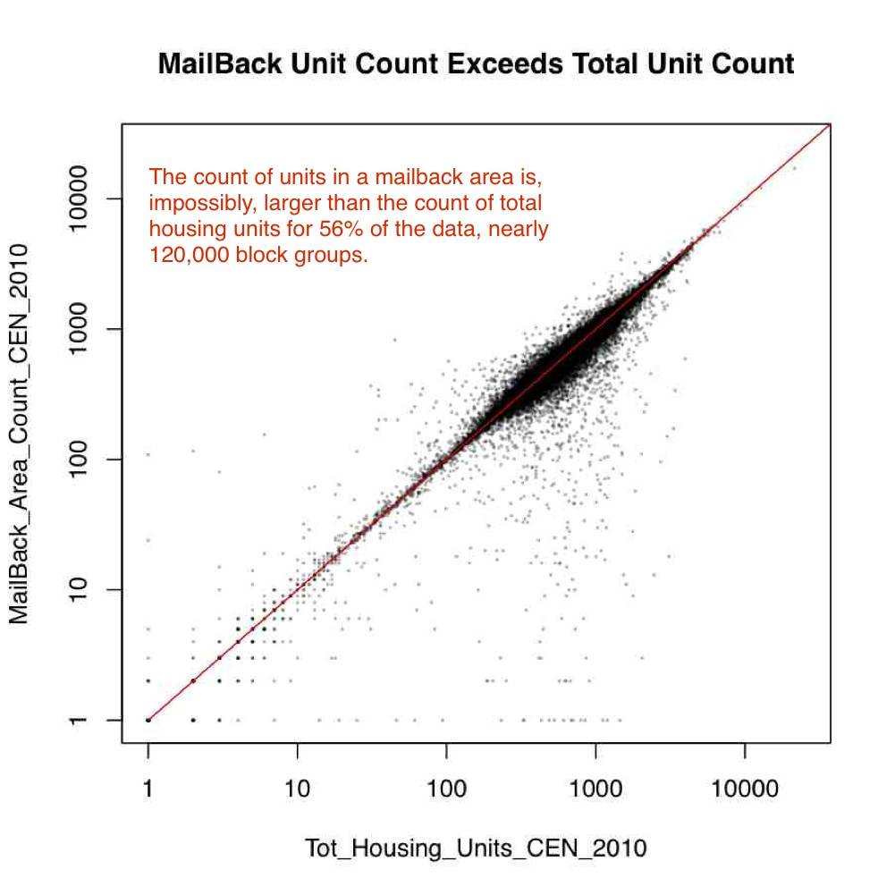
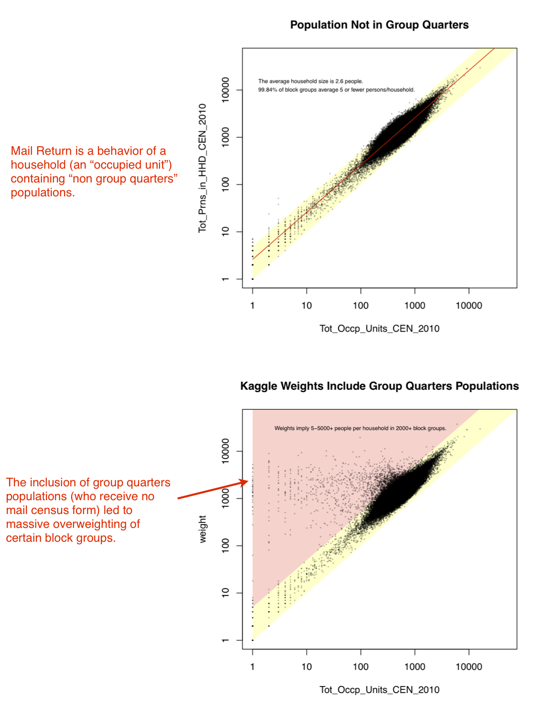
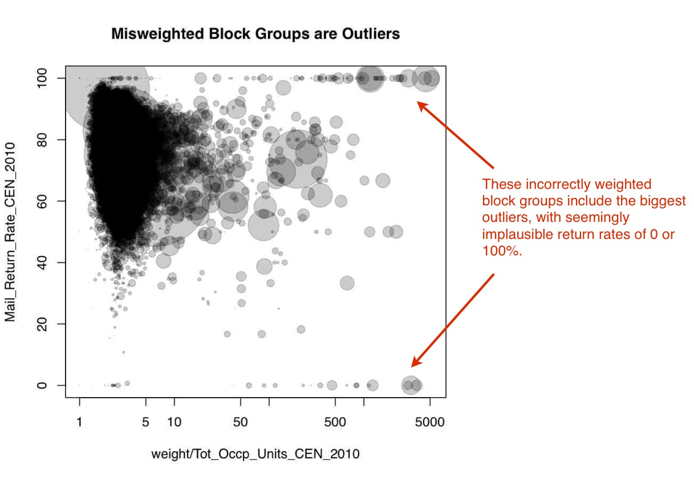
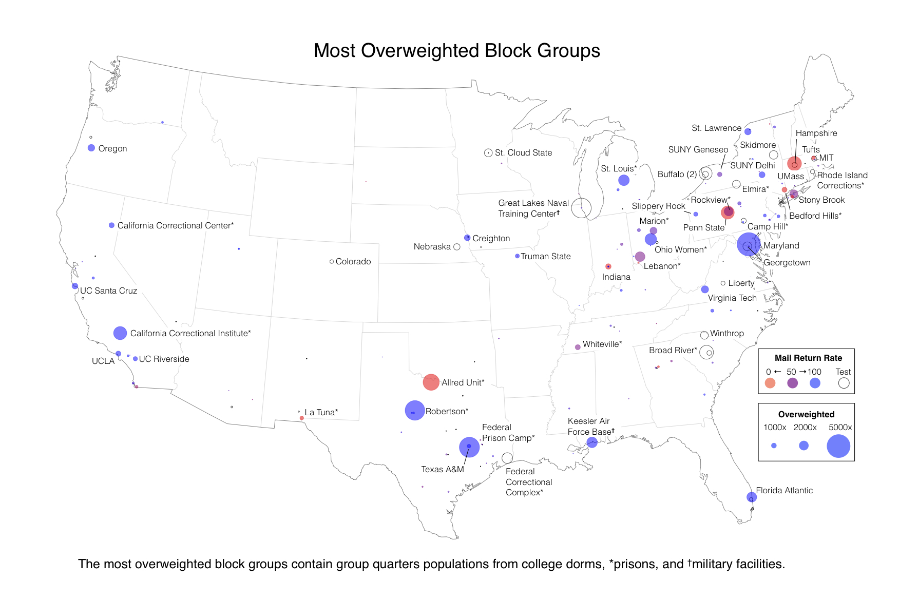
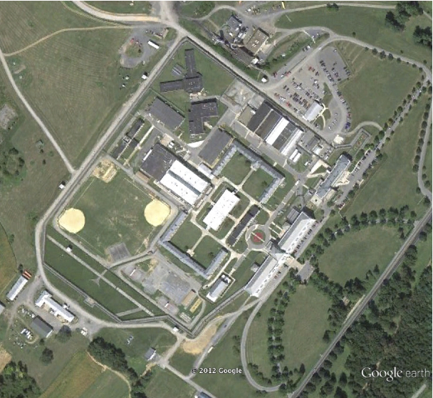
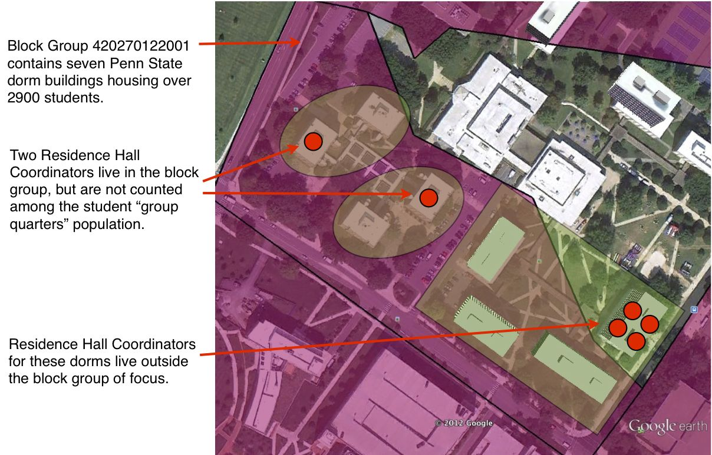

## _Note on "A Closer Look at the Kaggle Census Data."_
Big Data Social Science @ Penn State Team (Burt L. Monroe, Beatrice A. Abiero, Margaret H. Ariotti, Benjamin E. Bagozzi, John Beieler, Vito D'Orazio, Muhammed Y. Idris, Jennifer S. Mason, Joshua E. Stevens, Peifeng Yin, Jay Yonamine, and Christopher J. Zorn. [http://bdss.psu.edu](http://bdss.psu.edu))

_This archives the entry by the BDSS@PSU Team in the visualization portion of the Kaggle.com U.S. Census Return Rate Challenge, sponsored by the U.S. Census Bureau in the fall of 2012. This was in parallel to a prediction portion that challenged users to improve Census's model for prediction of household return rate on the decennial census._

_Both portions of the contest were predicated on data provided by Census for the contest. These data provided a long list of variables from the 2010 census for over 200,000 block-groups. Roughly 120,000 of the block-groups included the average 2010 household return rate (from 0 to 100%) for the block-group, with the remaining block-groups missing this variable and serving as the test data to be predicted._ 

_Our report documented idiosyncrasies and errors in the data, the correction of which we used to reach a "top 10%" rating in the prediction portion of the Challenge before it was shut down. The report also documents errors that gave the appearance of allowing for de-anonymization of some individuals in the data. The initial response was to remove our report. After discussions with Census and Kaggle, the report was reposted, and instead Census withdrew the data from public distribution and Kaggle closed the Challenge. Our report received the largest number of public votes in the visualization contest, but was not selected by Census as the winner._

_The 2017 acquisition of Kaggle by Google appears to have resulted (passively) in the deletion of the contest archive (an imageless version is available on the Internet Archive Wayback Machine [here](https://web.archive.org/web/20160804000444/www.kaggle.com/c/us-census-challenge/prospector#230)), so we provide the report in its entirety here._

# A Closer Look at the Kaggle Census Data

by the Big Data Social Science @ Penn State Team

Our team focused, in part, on efforts to understand the social process of "census mail return," as well as the complexities of the operational choices and other procedures that are part of the data generating process. We found anomalies. Some of these have modeling and predictive consequences, while some of them appear to [but probably do not] create minor violations of confidentiality.

## Some data have incorrect values

It appears, for example, that at least one key operational variable was simply truncated in about a quarter of its entries.

This was substantively important for the challenge, as the designation of "Type of Enumeration Area" captures prior expectations about the probable success of different mail return operational choices. 

## There are apparent inconsistencies in variable definitions.

The main variable of interest, mail return rate, is a proportion, the denominator of which is supposed to be MailBack Area Count, the number of "valid housing units in the mailback universe." This should be smaller than the total number of units, but in these data is larger more often than not. This could reflect errors in the data, or errors in the definitions provided in the data dictionary. 

## Group Quarters Populations distort evaluation weights

Populations in "group quarters" are not subject to Census mailback procedure and not included in the calculation of mail return rate. Presumably this was obvious for the block groups that contained 100% group quarters population, as they had no mail return rate and were eliminated. But thousands of block groups with as few as one valid mailback household were included. In such cases, the block group contains data for thousands of individuals irrelevant to mail return, all of whom contribute to the evaluation weight of the block group. 

## This has important consequences for the contest

This led to wild outliers. We improved our score substantially just by reweighting the data. If we had many more entries, we could simply have guessed 0/100, 0/50/100, 0/33.3/66.7/100, and so on for the extreme cases in the test data until we matched them perfectly. 

Of the 50 most over-weighted block groups, 30 contain college campuses, 18 contain prisons, and two contain military bases. Of these, 32 are in the training data and have mail response rates of 100 (21 cases), 0 (6), 50 (3), or 66.7 (2). 

(View the map at full scale [here](https://burtmonroe.github.io/BDSSKaggleCensus2012/images/usoverweightmap.jpg).)

## Some of the data appear to be easily de-anonymized

This focus on group quarters populations led us to notice what appeared to be minor breaches of confidentiality (but which in actuality simply accentuate the motivation for ignoring or downweighting block groups with high group quarters populations). In the most extreme cases, a block group is represented by a single household. Two of these extreme outliers happen to be in Centre County, Pennsylvania, home of Penn State.

Block Group 420279812021 (Row 30090) is the 18th most overweighted block group in the data. It has a population of 1999, 1997 of whom lived in group quarters. In fact, these 1997 people — 1935 of them men — lived in Rockview Prison, a few miles from us. Somewhere on or near the Rockview property are two housing units in the "mailback universe." One of these is recorded as unoccupied, but the other was recorded as rented by a married couple with no children who returned their census form. This “100%” mail return rate is counted for 1999 returned forms in the Kaggle data.  (Google Earth)

Block Group 420270122001 (Row 110760) is the 10th most overweighted block group in the data. It has a population of 2936, 2935 of whom lived in group quarters. These 2935 people were almost entirely freshmen at Penn State University, living in the East Dorms a few hundred yards from where we write. One other single individual, unmarried, male (because there are 0 "female household, no husband present" households) was recorded as living in the lone mailback household to receive a mailback census form. He is coded as not returning it, and this “0%” mail return rate is counted for 2936 unreturned forms in the Kaggle data. We did confirm that there are generally two Residence Hall Coordinators who live on site in the block group, receiving housing as part of their compensation. If using this as a permanent address, either of these could be counted in this block group, but outside the group quarters population of students.

After our original posting, and discussion with Census, we note it is standard practice at Census for data with low numbers of households to maintain statistical properties but mask sensitive individually identifiable information through techniques like data-swapping and synthetic data. By design, we cannot be certain of any individual match, as is appropriate. This does, however, accentuate the need in modeling to downweight or ignore these block groups. In such cases we not only have very little relevant data for mail return rate, but the data we have are unlikely to be accurate.  
